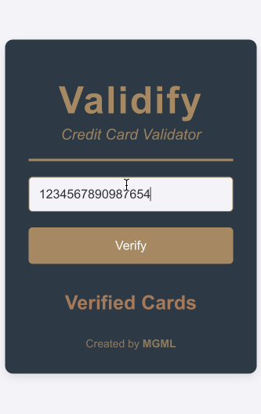
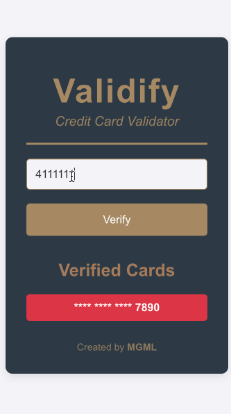
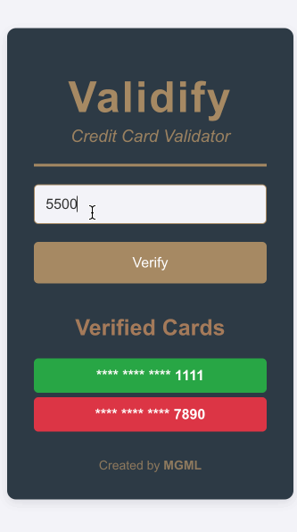
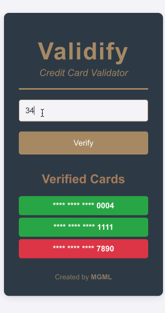

# Validify

**Validify** is a minimalistic web application designed to verify credit card numbers using the **Luhn Algorithm**. The application provides an intuitive interface for users to validate credit card numbers, view the results in a clear and visually appealing way, and keep track of the last five verified cards.

<!-- FEATURES -->
## **Features**

### **Core Features**
- **Real-Time Credit Card Validation**:
  - Validates credit card numbers using the Luhn algorithm to check their authenticity.
- **Clear Feedback**:
  - Displays whether a card is **VALID** (green) or **NOT VALID** (red) in a visually distinct manner.
- **Rolling History of Verified Cards**:
  - Shows the last five verified card numbers, hiding all digits except the last four for privacy.
  - Indicates validity status with color-coded labels: **green for valid** and **red for not valid**.
- **Responsive Input Form**:
  - Restricts input to numeric characters only and validates for 15 or 16 digits.

### **User Interface Features**
- **Design**:
  - Primary color scheme: Dark Blue-Gray (#2d3a45).
  - Accent color: Gold (#a68a64).
- **Minimalistic Layout**:
  - Clean UI that is user-friendly and distraction-free.
- **Footer Branding**:
  - Displays "Designed by MGML" with a clickable link.

### **Development Process Highlights**
1. **Validation Logic**:
   - Implemented the Luhn Algorithm to ensure accurate verification of credit card numbers.
   - Added input restrictions for better user experience, limiting characters to numeric values and enforcing length requirements.

2. **Feedback and Visual Cues**:
   - Introduced color-coded messages for clarity:
     - Green: Valid card numbers.
     - Red: Invalid card numbers.
   - Ensured messages are prominently displayed for easy readability.

3. **Rolling Verified Cards List**:
   - Maintains a history of the last five cards verified.
   - Displays only the last four digits for privacy.
   - Updates dynamically with the most recent card on top.

4. **Scalability**:
   - Modular and reusable code design with clear method documentation for future enhancements.

<!-- STACK -->
## **Tech Stack**
- **Frontend**: React.js
- **Styling**: CSS3
- **Algorithm**: Luhn Algorithm implemented in JavaScript

<!-- SETUP -->
## **Setup and Usage**
1. Clone the repository:
  ```bash
   git clone https://github.com/yourusername/validify.git
   cd validify
  ```
2. Install dependencies with `npm install`.
3. Start the application with `npm start`.
3. Open the app in your browser: `http://localhost:3000`
4. Enter a credit card number in the input field and click **"Verify"** to check its validity.
5. Use the **"Verify New Credit Card"** button to clear the input and add the checked number to the list.

<!-- SCREENSHOTS -->
## **Screenshots**

### Invalid Credit Card


### Visa Valid Credit Card


### Mastercard Valid Credit Card


### AMEX Valid Credit Card



<!-- LICENSE -->
## License

- Distributed under the MIT License with Trademark Clause. See `LICENSE` for more information.

<!-- CONTACT -->
## Author

<div align="center">

<a href="https://www.linkedin.com/in/michaelmayaguari/" target="_blank">

</a>

</div>